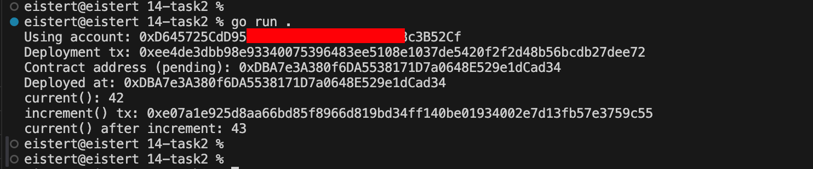

# 任务 2：合约代码生成 任务目标

使用 abigen 工具自动生成 Go 绑定代码，用于与 Sepolia 测试网络上的智能合约进行交互。

 具体任务
## 1、编写智能合约

1.1 使用 Solidity 编写一个简单的智能合约，例如一个计数器合约。

1.2 编译智能合约，生成 ABI 和字节码文件。

```
1、使用 nodejs，安装 solc 工具

npm install -g solc

2、使用命令，编译合约代码，会在当目录下生成一个编译好的二进制字节码文件 xxx.bin

solcjs --bin Counter.sol

使用命令，生成合约 abi 文件，会在当目录下生成 xxx.abi 文件：

solcjs --abi Counter.sol

使用 abigen 工具根据这两个生成 bin 文件和 abi 文件，生成 go 代码：

abigen --bin=Counter_sol_Counter.bin --abi=Counter_sol_Counter.abi --pkg=counter --out=counter.go


```


## 2、使用 abigen 生成 Go 绑定代码

2.1 安装 abigen 工具。
2.2 使用 abigen 工具根据 ABI 和字节码文件生成 Go 绑定代码。


## 3、使用生成的 Go 绑定代码与合约交互

3.1 编写 Go 代码，使用生成的 Go 绑定代码连接到 Sepolia 测试网络上的智能合约。
3.2 调用合约的方法，例如增加计数器的值。
3.3 输出调用结果。


## 4、测试合约交互截图
